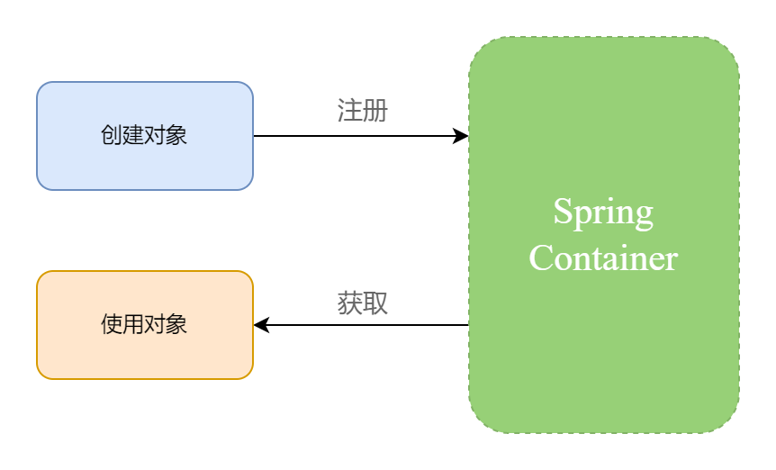
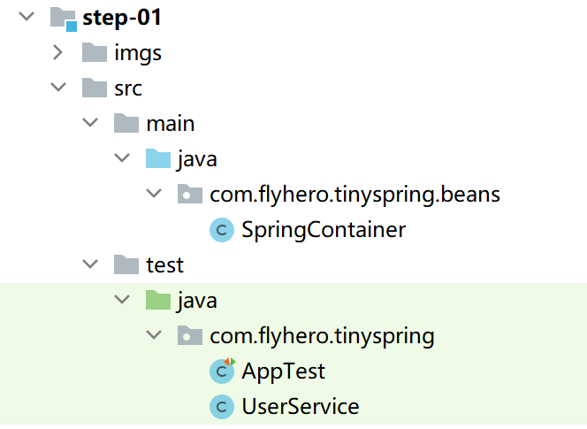

#### 前言

工作的前面三年，虽然一直在使用Spring，但对它却不甚了解，内心充满无数的疑问：为什么配置xml中bean就可以使用它？我的对象具体存在于哪里？为什么我的对象是单例模式？

每逢遇到面试问Spring的核心原理，都是死记硬背的标准答案。为了更清晰的了解它，我去看过几次Spring基本概念的介绍，但仍然是一头雾水，不知所云。因为这些介绍都是专业术语表达，具有简洁、抽象性，而我们在刚接触时是无法理解的，只有具象化的描述和实践才能真正的让我们去理解。

随着工作时间的增长，学习的知识更多，现在回过头去会看当时不了解的东西，发现其核心原理竟然是如此的简单明了。我将把我的理解过程整理出来以供大家参考。


#### 设计

我们先不去管IOC，DI, AOP等概念，就先从最简单的理解：容器（也有叫Spring容器、bean容器或IOC容器）

容器就是我们生活中用于盛东西的物体，比如：盆，桶，罐等。在程序世界中对其抽象，但他的主要作用仍然是存储。

所以你知道了吧？Spring容器的作用是存储我们的对象并管理对象的整个生命周期。

但是我们第一步要完成的是容器存储/获取我们的对象，管理对象的整个生命周期就后文慢慢道来。

所以我们进行如下设计：




我们要做的就是做一个容器，提供注册（存储）和获取功能。

1、找一个数据结构来存储对象。

我们需要选择一种数据结构来存储对象，而且需要通过对象的名称来查询出相应的对象，此时我们发现HashMap是最为合适的，而且HashMap无论是读取还是存入效率都是不错的。

2、提供注册和获取两个方法。

定义两个方法用于将对象存入上面的Map中和从Map中读取出来。


#### 实现


##### 目录结构




##### 源码

```java
package com.flyhero.tinyspring.beans;

public class SpringContainer {

    /**
     * 存储对象
     */
    private final Map<String, Object> beanMap = new ConcurrentHashMap<>();

    /**
     * 根据bean名称获取bean实例
     */
    public Object getBean(String beanName){
        return beanMap.get(beanName);
    }

    /**
     * 注册 Bean实例
     */
    public void registerBean(String beanName, Object bean){
        beanMap.put(beanName, bean);
    }
}
```

对，你没看错，Spring容器的实现用这一个类就实现了，我相信这么简单的开始所有人都懂吧。


#### 测试


##### 创建一个我们平常使用的类

```java
package com.flyhero.tinyspring;

public class UserService {
    public void print(){
        System.out.println("UserService print");
    }
}

```


##### 测试用例

```java
package com.flyhero.tinyspring;

public class AppTest 
{
    @Test
    public void testSpringContainer()
    {
        //1.构建一个Spring容器
        SpringContainer springContainer = new SpringContainer();

        //2.向容器中注册 我们的对象
        springContainer.registerBean("userService", new UserService());

        //3.从容器中获取 UserService 以及使用
        UserService userService = (UserService) springContainer.getBean("userService");
        userService.print();
    }
}
```

