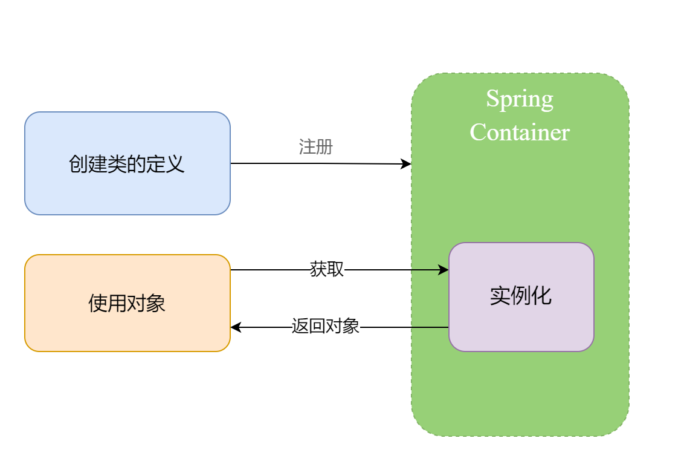
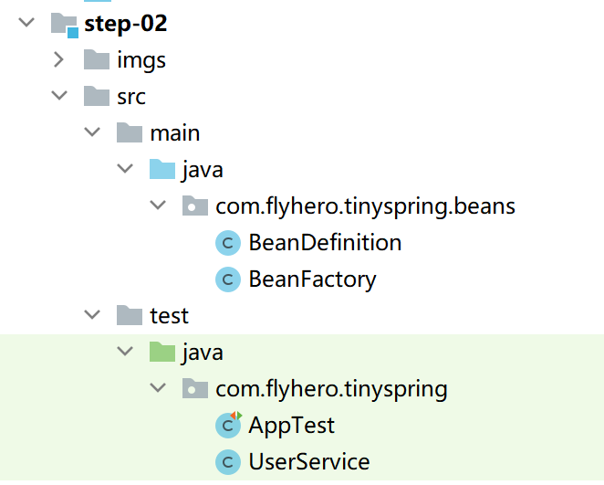

前面我们以及实现了一个最简单的容器，那么接下来我们将进一步升级下。

设计一个框架要有一个核心思想做指导，从可扩展性，性能考虑，利用设计模式、延迟化，池化、缓存等手段来实现。

所以上节我们的做法从扩展性的方面考虑，是完全不具备的。


#### 设计

使用我们框架的人我们称之为客户端，我们框架要做的就是让客户端少做一些工作，然而之前的设计是让客户端来创建对象再交给容器，所以为了减轻客户端的负担，我们要让容器来为客户端创建对象。 这是我们只要告诉容器，我们要的是什么类型的对象，容器便会帮助客户端创建这个对象。

于是我们有了如下设计：



1、创建一个新的对象用于包装要创建的类的类型


2、在客户端使用对象时，容器去实例化对象


#### 实现





##### BeanDefinition 定义

```java
public class BeanDefinition {

    // 交给容器管理的类型
    private Class<?> beanClass;

    public BeanDefinition(Class<?> beanClass) {
        this.beanClass = beanClass;
    }
    //...get/set
}
```

将实例化交给容器做，其实可以将上节中 beanMap 中的值由 Object改为Class即可，但是为了以后的可扩展性，这里将Class包装成一个新的BeanDefinition类。比如以后可以在这个类中标记 beanClass 是否单例、是否懒加载、注入的方式等信息。


##### BeanFactory 定义

```java
public class BeanFactory {

    // 以bean名称为key, BeanDefinition为value
    private final Map<String, BeanDefinition> beanDefinitionMap = new ConcurrentHashMap<>();

    public Object getBean(String beanName){
        Class<?> beanClass = beanDefinitionMap.get(beanName).getBeanClass();
        try {
            return beanClass.newInstance();
        } catch (InstantiationException | IllegalAccessException e) {
            throw new RuntimeException(e);
        }
    }

    public void registerBeanDefinition(String beanName, BeanDefinition beanDefinition){
        beanDefinitionMap.put(beanName, beanDefinition);
    }
}
```


BeanFactory 就是上节中的 SpringContainer，为了大家更容易阅读Spring源码，命名方面也按照它的方式。虽然 BeanFactory 命名看似工厂模式，但是现在我们不用去考虑，此刻它只是普普通通的一个容器类。


#### 测试


```java
@Test
public void testBeanFactory()
{
    //1.构建一个bean工厂
    BeanFactory beanFactory = new BeanFactory();

    //2.创建BeanDefinition
    BeanDefinition beanDefinition = new BeanDefinition(UserService.class);

    //3.向bean工厂注册 BeanDefinition
    beanFactory.registerBeanDefinition("userService", beanDefinition);

    //4.通过bean工厂获取 UserService
    UserService userService = (UserService) beanFactory.getBean("userService");
    userService.save();
}
```


对比和上一节的区别，我们这里并没有自己通过 `new` 关键词来创建对象，却可以从容器中拿到对象使用。
